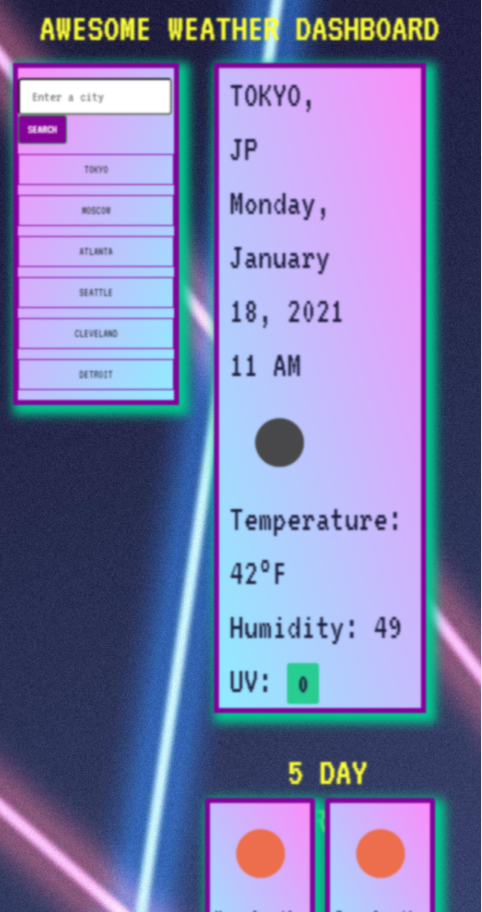

# weather-travel

## About this page

This bodacious page will show you the weather in any city you want! Just enter the city and hit search and the current weather as well as a 5 day forecast. The site relies on the [Open Weather Map API](https://openweathermap.org/)

Site is deployed at: [weather-travel](http://www.jacobaf.com/weather-travel/)

## Features

- This weather dashboard has a single input for a city, as well as up to 10 buttons for cities from previous searches.
- When a city is submitted into the search field a button is added to the search history and the current and future conditions are updated accordingly.
- The current weather conditions are presented with the city name, date, weather icon, temperature, humidity, and uv index.
- The UV index is color coded to show if conditions are favorable, moderate, or severe
- The five day forecast includes the date, weather icon, temperature, and humidity
- Clicking on any of the buttons in the search history will again display the current and future weather conditions for that city.
- Opening the weather dashboard will present the user with their last searched city. If there were no previous search, Detroit is loaded by default.
- The site is responsive and will have straigtened containers when viewed on a smaller screen.

## Potential Improvements

## Contents

- index.html
- README.md
- LICENSE
- (assets)
  - script.js
  - style.css
  - laserbg.jpg
  - collapsed.png
  - full-size.png

## Usage

#### Welcome Screen

## Credits

A thank you forever for reference material at [MDN](https://developer.mozilla.org/en-US/), [w3 Schools](http://w3schools.com), and [Stack Overflow](https://stackoverflow.com/).

## License

This website is licensed under the MIT license, copyright 2021
